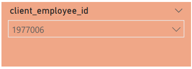
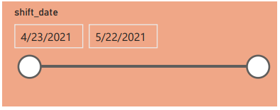
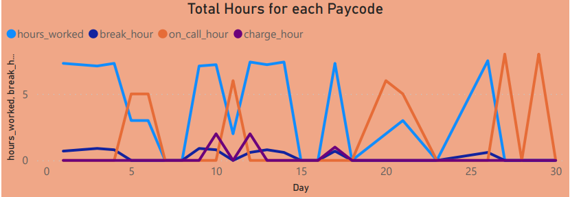
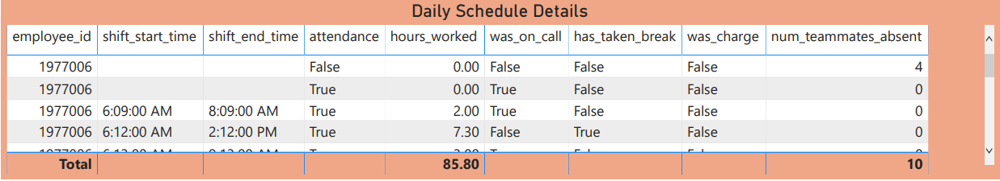
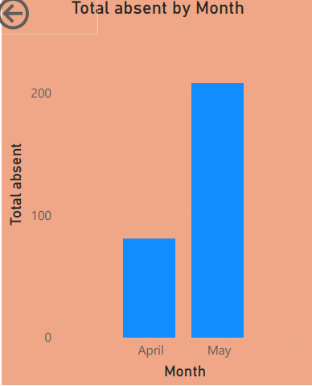
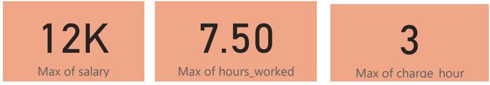
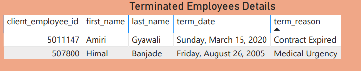
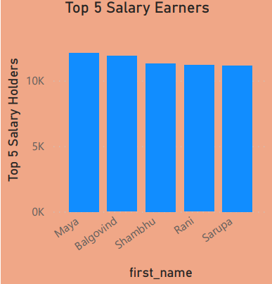
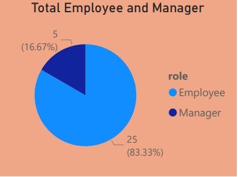

# Data Visualization of Timesheet Data
The Day3.pdf file can be looked to know how the dashboard looks like. The Day3.pbix file is the powerbi format file.
TO Know about the dashboard, first of all we should know about the two slicers which are:

* Employee ID slicer
* Shift Date slicer
These slicers are basically filters which filters the line chart and timesheet details according to the employee id and shift date provided.

The employee id can be filtered with the slicer given below:

THe shift date can be filtered with the slicer given below:

Note: These filters are only applied to the line chart and timesheet details.

The line chart can be used to look which employee worked for how many hours on total, if they were on charge then charge hour and if they took break then total break hour and similarly to if they were on call on the basis of shift date.

Similarly, in table format the details can be seen in timesheet details table.

There is a bar graph to see total number of employee who are absent in each month.

There is a KPI to look max salary, hours worked and charge hour.
This is to know what is the maximum the company is providing. Similarly, if someone is working greater than 8 hours can be found.

The table below shows employees who are terminated and the reason they were terminated.

The following bar chart shows the top 5 salary holders of the company.

The pie chart below shows the total number of employees based on normal employee and manager.
There should be less managers than employee.

That's all for the necessary data visualization of timesheet.

